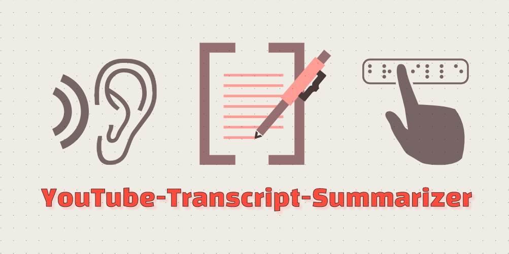

# Youtube Transcript Summarizer



This project is an integration of web development and the very emerging technology, Machine Learning. This Project aims to provide summarized documentation of a video that are too long to be watched. Today education is more dependent on online sources rather than the offline source, and no one has much time to spent on lecture videos that are too long to watch. So, to resolve this, there should be a tool which can provide a summarization of the video and therefor save time.

## Solution Approach
Enormous number of video recordings are being created and shared on the YouTube throughout the day. It becomes really difficult to spend time in watching such videos which may have a longer duration than expected and sometimes our efforts may become futile if we aren’t able to find relevant information out of it. Summarizing transcripts of such videos will allows us to quickly look out for the important patterns in the video and helps us to save time and efforts to go through the whole content of the video.

## Features

- Multiple Langauage Support (Hindi,English,Gujarati,Braille)
- Runtime Text to Speech Conversion (English language Only)
- Get Transcripts of videos of any length.
- Get Summarization of video of any language.
- Downloadable Transcripts.

- [Screen-shots](https://github.com/venisprajapati/youtube-transcript-summarizer/tree/main/screen-shots)
- [Result Analysis Reports](https://github.com/venisprajapati/youtube-transcript-summarizer/blob/main/youtube-transcript-summarizer-api/Result_Analysis_Reports.pdf)


## Installation

1. Clone the repository in your local machine.
```
git clone https://github.com/venisprajapati/youtube-transcript-summarizer.git
```

2. To run the API, you need to set up a **Virtual Environment**. Go into *youtube-transcript-summarizer-api* folder, open command prompt (1) and paste the following command.
```
cd youtube-transcript-summarizer-api
python -m venv venv
```

3. Now that you got a Virtual Environment created, Activate **venv** ,now it's time to install all the **dependencies**. Use the following command.   
```
venv\Scripts\activate
pip install -r requirements.txt
```
4. Now it's time to run the **API**. Don't close command prompt (1).
```
python app.py
```
5. Now the API is set up to provide the response. Its time to start with **frontend**. Open command prompt (2) in the root directory of the project.
```
cd youtube-transcript-summarizer-frontend
```
6. Install all the required **node modules**.
```
npm install
```
7. You are all set to run the frontend.
```
npm start
```
8. Open Chrome Browser, go to Extensions, **Unpack Load** the **youtube-transcript-summarizer-web-browser-extension** directory, then use the chrome extension :)

## Contributing
Pull requests are welcome. For major changes, please open an issue first to discuss what you would like to change.

Please make sure to update tests as appropriate.

## Authors

- [@Venis_Prajapati](https://www.github.com/venisprajapati)
- [@Virag_Patel](https://www.github.com/19IT114)


*thank you*
